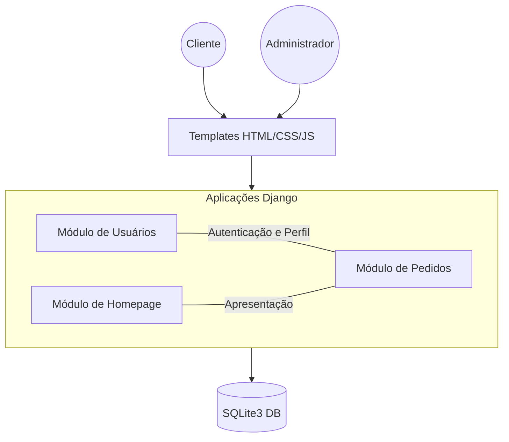

# 🍕 Pizzaria D'Boa - Sistema de Pedidos de Pizza

## 🎯 Objetivo e Problema

**Objetivo:** Facilitar o processo de pedido de pizzas para clientes e otimizar a gestão interna para a pizzaria, proporcionando uma experiência digital fluida e moderna.

**Problema:** O gerenciamento manual de pedidos via telefone ou mensagens muitas vezes resulta em erros de comunicação, demora no atendimento e dificuldade em rastrear o status e histórico de pedidos tanto para o cliente quanto para o estabelecimento.

## 🏗️ Arquitetura do Sistema

O sistema segue a arquitetura **MVT (Model-View-Template)** do Django, organizada nos seguintes módulos:



## 📋 Sobre o Projeto

Pizzaria D'Boa é um sistema web desenvolvido em Python/Django para gerenciamento de pedidos de pizza online. O projeto oferece uma interface intuitiva para clientes realizarem seus pedidos e para a administração gerenciar o fluxo de pedidos.

## 🚀 Tecnologias Utilizadas

- **Backend:** Python (95.7%)
- **Frontend:** JavaScript (1.7%), CSS (1.4%)
- **Framework:** Django
- **Banco de Dados:** SQLite3

## 📁 Estrutura do Projeto
```plaintext
Pizzaria-D-Boa/
├── homepage/           # Página inicial do sistema
├── media/
│   └── imagens_pizzas # Imagens dos produtos
├── pedidos/           # Gestão de pedidos
├── pizzaria/          # Configurações principais
├── static/            # Arquivos estáticos
├── templates/         # Templates HTML
├── usuarios/          # Gestão de usuários
├── venv/             # Ambiente virtual
├── manage.py         # Script Django
├── requirements.txt  # Dependências
└── db.sqlite3       # Banco de dados
```

## ⚙️ Pré-requisitos

- Python 3.x
- Django
- Virtualenv (recomendado)
- SQLite3

## 🔧 Instalação

1. Clone o repositório:
   ```bash
   git clone https://github.com/betolara1/Pizzaria-D-Boa.git
   cd Pizzaria-D-Boa
```

2. Crie e ative um ambiente virtual:

```shellscript
python -m venv venv
source venv/bin/activate  # Linux/Mac
venv\Scripts\activate     # Windows
```


3. Instale as dependências:

```shellscript
pip install -r requirements.txt
```


4. Execute as migrações:

```shellscript
python manage.py migrate
```


5. Crie um superusuário:

```shellscript
python manage.py createsuperuser
```


6. Inicie o servidor:

```shellscript
python manage.py runserver
```

### 🐳 Rodando com Docker (Recomendado)

1. Certifique-se de ter o Docker e Docker Compose instalados.
2. Crie um arquivo `.env` baseado no `.env.example`:
   ```bash
   cp .env.example .env
   ```
3. Suba o container:
   ```bash
   docker-compose up --build
   ```
4. O sistema estará disponível em `http://localhost:8000`.

## 💻 Funcionalidades

### Para Clientes

- Cadastro e login de usuários
- Visualização do cardápio de pizzas
- Realização de pedidos
- Acompanhamento do status do pedido


### Para Administradores

- Gestão de produtos
- Gerenciamento de pedidos
- Controle de usuários
- Relatórios e estatísticas


## 📲 Exemplos de Request/Response

### 🔑 Autenticação (Login)
**Endpoint:** `/usuarios/login/` (POST)
- **Request Body:**
  ```json
  {
    "username": "joao_silva",
    "senha": "minhasenha123"
  }
  ```
- **Response:** Redirecionamento para a Home em caso de sucesso ou mensagem de erro em `messages`.

### 🍕 Criar Pedido
**Endpoint:** `/pedidos/fecharpedido/` (POST)
- **Request Body (Form Data):**
  ```yaml
  tamanho: "G"
  sabores: [1, 3] # IDs dos sabores: Calabresa, Marguerita
  observacao: "Sem cebola"
  entregasim: "on"
  ```
- **Response:** Redirecionamento para `/pedidos/pedido/` com mensagem de sucesso.

## 📱 Módulos Principais

1. **Homepage**

1. Página inicial
2. Apresentação do cardápio
3. Promoções


2. **Pedidos**

1. Carrinho de compras
2. Histórico de pedidos
3. Status de entrega


3. **Usuários**

1. Cadastro
2. Autenticação
3. Perfil do usuário


4. **Administração**

1. Painel administrativo
2. Gestão de produtos
3. Controle de pedidos


## 🔐 Configuração do Ambiente

1. Configure as variáveis de ambiente:

1. SECRET_KEY
2. DEBUG
3. ALLOWED_HOSTS


2. Configure o banco de dados no arquivo settings.py
3. Configure as informações de email para recuperação de senha


## 🤝 Contribuições

Contribuições são bem-vindas! Para contribuir:

1. Faça um Fork do projeto
2. Crie uma branch para sua feature (`git checkout -b feature/NovaFeature`)
3. Commit suas alterações (`git commit -m 'Adiciona nova feature'`)
4. Push para a branch (`git push origin feature/NovaFeature`)
5. Abra um Pull Request


## 📄 Licença

Este projeto está sob a licença MIT. Veja o arquivo `LICENSE` para mais detalhes.

## 👤 Autor

- GitHub: [@betolara1](https://github.com/betolara1)


## 📞 Suporte

Em caso de dúvidas ou problemas:

1. Abra uma issue no GitHub
2. Consulte a documentação
3. Entre em contato com o desenvolvedor


## 🔍 Status do Projeto

✅ Projeto Completo

---

⭐️ Se este projeto te ajudou, considere dar uma estrela no GitHub!
